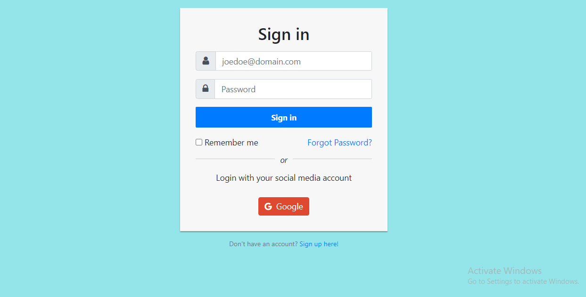
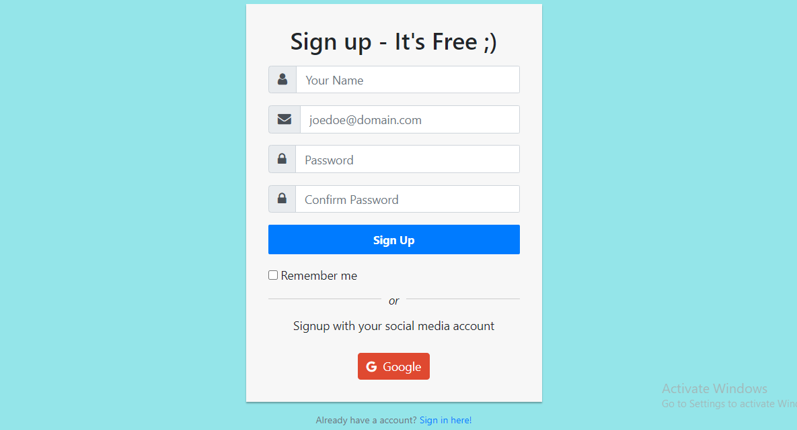
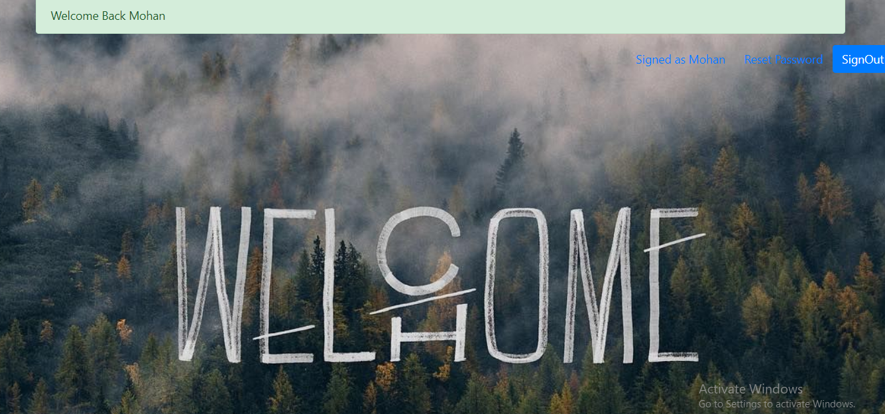
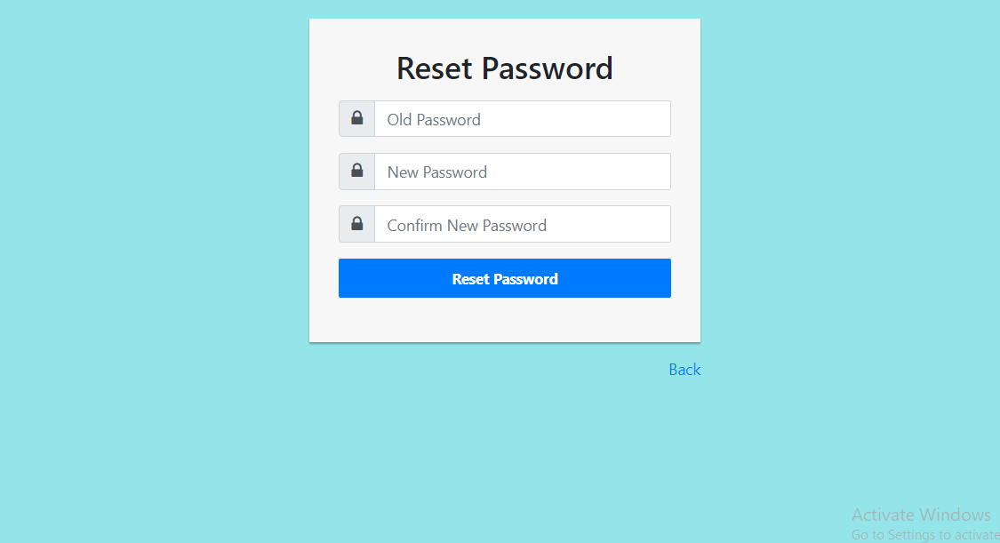
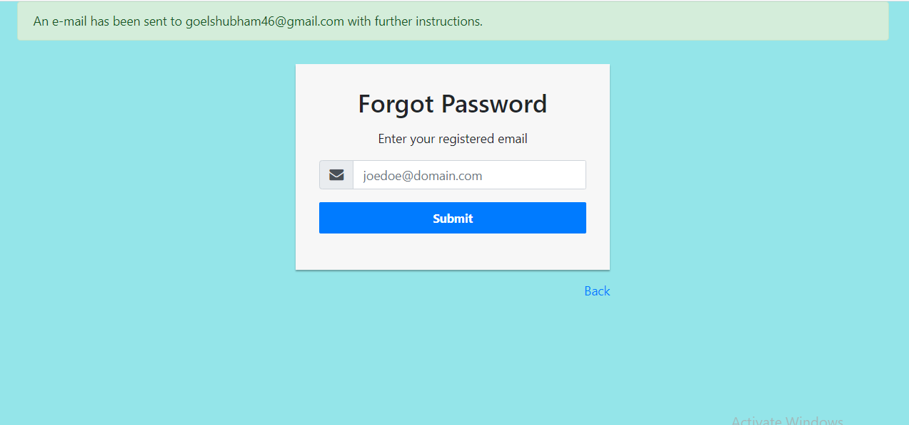

# Authentication-System
This Node js project is a complete authentication system which can be used as a starter code for creating any new application. I have used passport js library for authentication. User can also authenticate with their google account. Also, if forgot a password user get the link to reset their password on their registered email which is implemented by nodemailer library.

## Technologies and Frameworks Used
* Nodejs
* MongoDB
* Express

## Some Snapshots of application

#### Sign In

#### Signout

#### Home

#### Reset Password

#### Forgot Password

## Folder Structure
* Assets: It contains css , images and js files.
* Config: It contains connection to MongoDB Database and local passport and google passport strategy setup.
* Controller: Actions performed on Database data on cleint request.
* Models: It contains Database Schema.
* Routes: It contains all paths of our application.
* Views: Final Presentable response to end users.

## How to setup the Project
- Clone the project.
- Go to correct directory.
- Connect to mongodb.
- npm install the required dependencies.
- Get your copy of cleintID and cleintSecret from https://console.developers.google.com/apis/dashboard for Google auth.
- Run command: nodemon index.js
- Go to https://localhost/8080.
